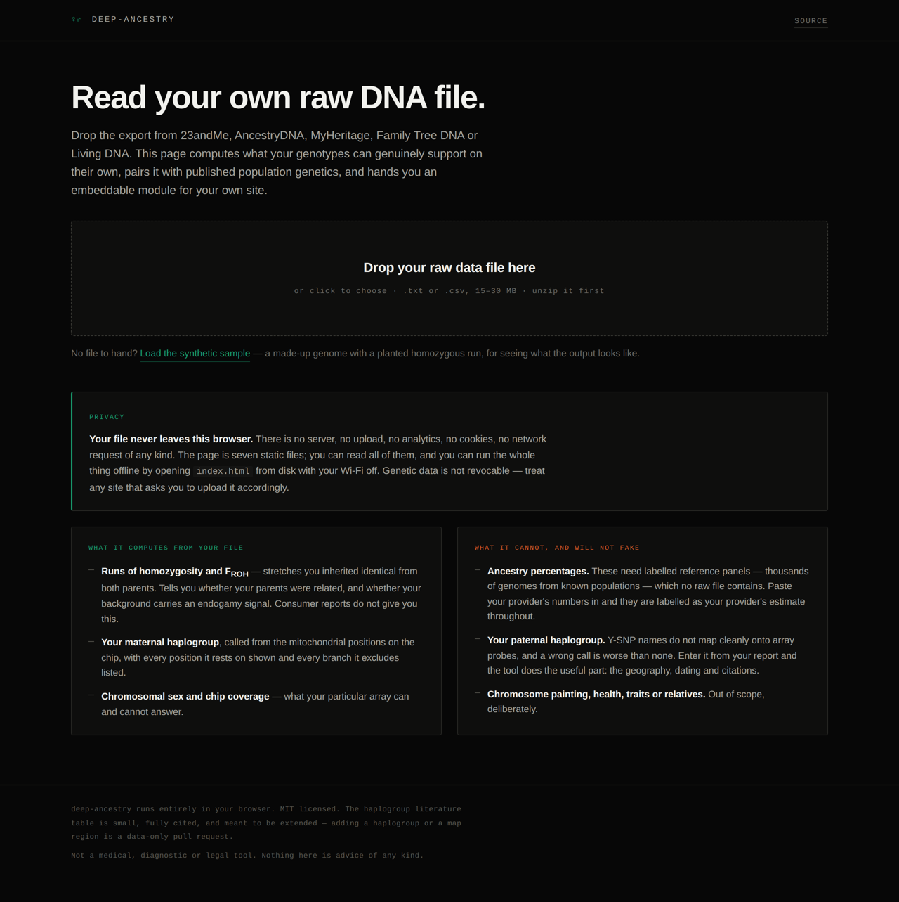

# deep-ancestry

**Read your own raw DNA file, in your own browser, and get an embeddable module for your site.**

Drop the export from 23andMe, AncestryDNA, MyHeritage, Family Tree DNA or Living DNA. The page
computes what your genotypes genuinely support on their own, pairs it with published population
genetics, and hands you a self-contained HTML module you can paste into a personal site.

No server. No upload. No analytics. No cookies. No network requests of any kind. Seven static files — you can read all of them, and you can run the whole thing offline.



---

## Why this exists

Consumer reports give you a pie chart and a haplogroup name. They do not tell you where those
numbers come from, what the array could not see, or what your own genotypes can prove without any
reference data at all. This tool is built the other way round: **every number is either computed
from your file and shown with its evidence, or labelled as your provider's estimate.** Nothing in
between, and nothing invented.

That constraint is the whole design. It is also why the tool is smaller than you might expect.

## What it computes from your file

| | |
|---|---|
| **Runs of homozygosity, and F<sub>ROH</sub>** | Stretches of chromosome you inherited identical from both parents. Tells you whether your parents were related, and separately whether your ancestry carries a background endogamy signal. Needs nothing but your own genotypes, and no consumer report gives it to you. |
| **Maternal haplogroup** | Called from the mitochondrial positions on your chip, against a curated fragment of the mtDNA phylogeny. Every position the call rests on is shown; every branch it excludes is listed; branches the chip cannot test are named. |
| **Chromosomal sex and chip coverage** | From chrX heterozygosity and chrY call rate, plus what your particular array does and does not carry. |

## What it will not fake

**Ancestry percentages.** Assigning a chromosome segment to a population requires labelled
reference panels — thousands of genomes from known populations. No raw file contains them, and
this tool does not ship them. You paste your provider's numbers in, and they are labelled as your
provider's estimate everywhere they appear.

**Your paternal haplogroup.** Y-SNP names do not map cleanly onto consumer array probes, and a
confidently wrong Y call is worse than no call. Enter yours from your report and the tool does the
part that is actually useful: geography, dating, frequencies, citations.

**Chromosome painting, health, traits, relatives.** Out of scope, deliberately. A painting view
would look wonderful and would be entirely invented.

## The runs-of-homozygosity result, and why the filters matter

ROH detection is the one place a naive implementation produces spectacular, completely wrong
numbers. Look for gaps between heterozygous calls and you get 20–27 Mb "runs" on chromosomes 1, 9
and 16 every single time. Those are centromeres and heterochromatin, where the array simply has no
probes — and **absence of heterozygous calls is not evidence of homozygosity.**

This implementation is PLINK-style: a 50-SNP sliding window allowing one heterozygote, merged runs
kept only at ≥1 Mb, ≥100 SNPs, ≥20 SNPs/Mb, with a 1 Mb maximum gap between consecutive markers.
The density floor and the gap cap are what keep the centromeres out. Without them F<sub>ROH</sub>
comes out roughly **eight times too high**.

Segment *length* carries the information, not the total: a shared ancestor *n* generations back
leaves segments of characteristic size. First-cousin parents give F<sub>ROH</sub> near 0.0625 with
several segments over 10 Mb. Many short segments and none long is a different thing entirely —
background relatedness from endogamy, many distant shared ancestors rather than one recent one.
The tool reports the length distribution and says which pattern it sees.

## Privacy

Genetic data is not revocable. You cannot change it, and you cannot take it back once it is
somewhere else.

- The file is read with `FileReader` and held in memory for the length of the page view.
- There is no fetch, no XHR, no WebSocket, no beacon, no third-party script, no font CDN, no
  analytics anywhere in this repository. Grep for it.
- Close the tab and it is gone. Nothing is written to storage.
- The exported module contains only what you chose to include — the ROH view and the maternal
  evidence table are both optional, because both say something about your family rather than only
  about you.
- Verify it yourself: turn off your network and load the page from disk. Everything works.

## Running it

**Hosted** — GitHub Pages, or any static host. The included workflow deploys `main` on push.

**Locally, over http** (needed only for the *Load the synthetic sample* button):

```bash
git clone https://github.com/gcarosso/deep-ancestry && cd deep-ancestry
python3 -m http.server 8000     # then open http://localhost:8000
```

**Locally, from disk** — open `index.html` directly. Everything works except the sample button;
browsers block a page opened from `file://` from reading sibling files, which is a security
feature, not a bug. Drag `data/sample-23andme.txt` onto the drop zone instead.

## Using the module you get

The download is one file with two blocks: a `<style>` and a `<section class="anc">`. Paste both
into any page. No JavaScript, no webfonts, no network requests — all interaction is CSS
(`:hover`, `:focus-visible`, `:has`), so it renders complete with JS disabled and is keyboard
navigable. Every rule is scoped under `.anc`; nothing leaks either way. It paints its own dark
ground, so it sits as a deliberate inset panel on a light page.

## Repository layout

```
index.html               the app shell
assets/style.css         application chrome
assets/data.js           mtDNA phylogeny fragment + the literature table
assets/geo.js            coastline sketch + region gazetteer
assets/analyze.js        parsing, ROH, mtDNA classification, sex inference
assets/render.js         the module: three views, the CSS, the export
assets/app.js            UI wiring
data/sample-23andme.txt  synthetic sample genome (not a real person)
tools/make_sample.py     regenerates it
```

The module's styles live in `render.js`, not in a stylesheet, so the live preview and the exported
file are literally the same string and cannot drift apart.

## Extending it

The two data tables are meant to grow, and both are data-only pull requests:

- **`LITERATURE` in `assets/data.js`** — haplogroup dating, published frequencies, citations. It
  ships small and fully sourced on purpose. Entries carry `precision: 'published'` for a specific
  figure from a named paper and `precision: 'estimate'` for a widely-reported range, and the two
  render differently so nobody mistakes one for the other. **An entry without a citation does not
  belong in the table.**
- **`REGION_GEO` in `assets/geo.js`** — provider region names to map positions. Names with no
  entry are listed in the module's caption rather than dropped silently.

The map ships a European and Mediterranean coastline. Frequencies outside that frame are listed
rather than drawn; if your lineage's geography falls outside it, the map view is replaced by a note
and the other views are unaffected. Adding a coastline is also a data-only contribution.

See [CONTRIBUTING.md](CONTRIBUTING.md).

## Limits worth stating plainly

- A haplogroup traces **one ancestor per generation** out of thousands. Twelve generations back you
  had more than a thousand ancestors; two haplogroups describe two of them.
- Consumer arrays carry a few thousand mitochondrial and Y positions chosen in the early 2010s. A
  haplogroup resolves to the depth those markers allow and no further. Going deeper needs
  sequencing, and mitochondrial sequencing is cheap.
- F<sub>ROH</sub> is computed against a fixed GRCh37 autosome length. Different tools use different
  denominators, so compare the segment distribution rather than the headline number across tools.
- The mtDNA tree covers the major branches, not all of PhyloTree. An unassignable sample gets no
  call rather than a guess.
- **Not a medical, diagnostic, forensic, or legal tool.** Nothing here is advice of any kind.

## Licence

MIT. See [LICENSE](LICENSE).
